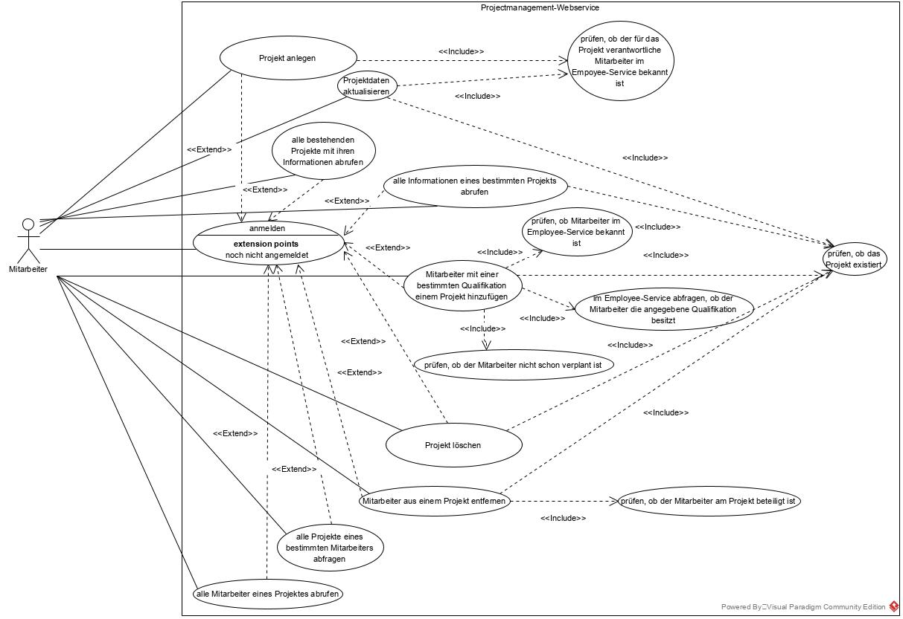

# Anforderungen – Project-Management-Service (PMS)

> Gesammelt für später: Originaltext der Anforderungsdefinition, Use-Case-Diagramm,
> unsere Analyse (Entwurf) und die nächste Aufgabe (Sprintplanung).



---

## 1. Anforderungsdefinition (Originaltext)

Es ist ein REST-Service als Microservice zur Projektverwaltung zu implementieren. Die Nutzer dieses Webservices sind Mitarbeiter der HiTec GmbH. Mit Hilfe des Webservices sollen Mitarbeiter Projekte anlegen können. Ein Projekt besitzt dabei eine eindeutige Id, eine Bezeichnung, die Id des für das Projekt verantwortlichen Mitarbeiters, die Id des Kunden, der das Projekt in Auftrag gegeben hat, den Namen der zuständigen Person beim Kunden, ein Kommentar, der das Projektziel skizziert, sowie ein Startdatum und ein Enddatum. Außerdem werden alle Mitarbeiter erfasst, die bei dem Projekt mitwirken, jeweils mit ihrer Id und der Qualifikation, mit der sie in diesem Projekt eingesetzt sind. Diese Qualifikation muss zu einer der beim Employee-Service hinterlegten Qualifikationen des jeweiligen Mitarbeiters passen.

Der Webservice soll folgende Use-Cases zum Lesen von Daten im Json-Format bereitstellen. Ein User soll alle Projekte abrufen können. Jedes Projekt wird dabei durch alle oben aufgelisteten Daten beschrieben. Des Weiteren soll ein User ein ganz bestimmtes Projekt mit allen seinen Daten anhand dessen Id auslesen können. Zu einem ganz bestimmten Projekt soll ein User des Webservices drittens alle Mitarbeiter eines Projektes abfragen können. Dieser Use-Case sieht vor, die Projekt-Id, die Projektbezeichnung sowie eine Liste der Mitarbeiter, die jeweils mit Id und Qualifikation im angeforderten Projekt beschrieben werden, herauszugeben.

Selbstverständlich können sich Projektdaten ändern, so dass es eine Update-Funktionalität geben muss. Auch sollen Projekte gelöscht werden können.

Bereits existierenden Projekten sollen Mitarbeiter zugewiesen werden können. Ein Mitarbeiter ist dabei immer nur einem Projekt gleichzeitig zugeordnet, ein anteiliger Einsatz in mehreren Projekten zur selben Zeit ist nicht vorgesehen. Deshalb muss bei der Zuweisung geprüft werden, ob sich der Zeitraum von Start- bis Enddatum mit einem anderen Projekt überschneidet, dem der Mitarbeiter bereits zugeordnet ist. Ist das der Fall, soll der User eine entsprechende Fehlermeldung erhalten. Des Weiteren sollen Mitarbeiter aus Projekten auch wieder entfernt werden können. Für beide Anwendungsfälle sind sinnvolle Antworten im JSON-Format zu überlegen.

Ein User soll anhand einer bestimmten Mitarbeiter-Id die Projekte abfragen können, an denen der Mitarbeiter mitgewirkt hat. Die Antwort des Project-Management-Services enthält einmalig die Id des Mitarbeiters, sowie eine Liste mit den Projekten, die mit ihrer Id, ihrer Bezeichnung, Start- und Enddatum sowie der Qualifikation im Projekt beschrieben werden.

Der Webservice muss überall dort, wo es nötig ist, prüfen, ob verwendete Mitarbeiter-Ids oder Kunden-Ids valide sind. Existiert eine Mitarbeiter-Id nicht, oder besitzt ein Mitarbeiter eine Qualifikation nicht, mit der er in einem Projekt eingesetzt werden soll, soll der anfragende User entsprechende Fehlermeldungen mit den üblichen Http-Statuscodes bekommen. Für die Validierung der Mitarbeiter existiert bereits der Microservice Employee-Service. Eine Dokumentation dieses Services ist nach dem Start der lokalen Entwicklungsumgebung (`docker compose up`) über die URL http://localhost:8089/swagger erreichbar. Dort ist genau beschrieben, wie auf den Employee-Service zugegriffen werden kann. Damit sich die Anwender der firmeninternen Services nicht bei jedem neu implementierten Service neu anmelden müssen, werden alle Services zentral über einen Authentik-Service abgesichert. Bei der Anmeldung erhält der User aller firmeninternen Services einen JWT, der bei jeder Anfrage zur Authentifizierung mitgesendet werden muss.

Ein Kunden-Service, der die Kundendaten verwaltet, ist zwar noch nicht vorhanden, wird aber parallel von einem anderen Team implementiert. Zur Prüfung, ob ein Kunde mit einer bestimmten Kundennummer existiert, wird in Zukunft ein API-Call dieses Service nötig sein. Das ist bereits programmatisch mit einer Dummy-Methode vorzusehen.

Die genannten Anforderungen sind auch noch einmal dem beigelegten Use-Case-Diagramm zu entnehmen.

Der zu implementierende Project-Management-Service soll eine Swagger-Dokumentation erhalten.

Die verschiedenen Anwendungsfälle sollen mit Integrationstests abgedeckt werden, d.h. ein Test für den "Happy-Path", also den Erfolgsfall, sowie jeweils ein Test für jeden Negativfall.

---

## 2. Nächste Aufgabe: Sprintplanung (in sprint.heidelab.de)

Der Service soll innerhalb **eines Sprints** fertig gestellt werden:

- [ ] User-Stories anlegen
- [ ] Akzeptanzkriterien je Story formulieren
- [ ] Stories in Tasks untergliedern
- [ ] Stories priorisieren
- [ ] Aufwand per Schätzpoker in Punkten schätzen
- [ ] Sprint anlegen und alle Stories zuweisen

Anleitung: im Tool über das „?"-Symbol oben rechts. Link: https://sprint.heidelab.de/anmelden

---

## 3. Unsere Analyse (Entwurf – in der Sprintplanung gemeinsam festlegen)

### 3.1 Datenmodell

**Projekt**

| Feld | Typ (Vorschlag) | Hinweis |
|---|---|---|
| id | Long | von der DB vergeben |
| bezeichnung | String | Pflicht |
| verantwortlicherMitarbeiterId | Long | gegen Employee-Service prüfen |
| kundenId | Long | gegen Kunden-Service prüfen (Dummy) |
| kundenAnsprechpartner | String | Name der zuständigen Person beim Kunden |
| kommentar | String | Projektziel |
| startDatum | LocalDate | |
| endDatum | LocalDate | darf nicht vor startDatum liegen |
| mitarbeiter | Liste von Projektmitarbeitern | 1 Projekt : n Mitarbeiter |

**Projektmitarbeiter** (Zuordnung Mitarbeiter ↔ Projekt)

| Feld | Typ | Hinweis |
|---|---|---|
| mitarbeiterId | Long | gegen Employee-Service prüfen |
| qualifikation | String | muss eine Qualifikation des Mitarbeiters im Employee-Service sein |

### 3.2 Use-Cases → REST-Endpunkte (Vorschlag)

| # | Use-Case | Methode + Pfad | Erfolg | Fehlerfälle |
|---|---|---|---|---|
| 1 | Projekt anlegen | `POST /projects` | 201 | 400 ungültige Felder / Enddatum vor Startdatum, 404 verantw. Mitarbeiter oder Kunde unbekannt, 401 |
| 2 | alle Projekte abrufen | `GET /projects` | 200 | 401 |
| 3 | ein Projekt abrufen | `GET /projects/{id}` | 200 | 404 Projekt unbekannt |
| 4 | Projektdaten aktualisieren | `PUT /projects/{id}` | 200 | 404 Projekt / Mitarbeiter, 400 |
| 5 | Projekt löschen | `DELETE /projects/{id}` | 204 | 404 |
| 6 | Mitarbeiter mit Qualifikation hinzufügen | `POST /projects/{id}/employees` | 201 | 404 Projekt / Mitarbeiter, 400/422 Qualifikation fehlt, 409 bereits verplant (Zeitraum überschneidet sich) |
| 7 | Mitarbeiter aus Projekt entfernen | `DELETE /projects/{id}/employees/{employeeId}` | 204 (oder 200 + JSON) | 404 Projekt / Mitarbeiter nicht im Projekt |
| 8 | alle Mitarbeiter eines Projekts | `GET /projects/{id}/employees` | 200 | 404 |
| 9 | alle Projekte eines Mitarbeiters | `GET /employees/{employeeId}/projects` | 200 | 404 Mitarbeiter unbekannt |

Alle Endpunkte erfordern einen gültigen JWT (sonst **401**) – im Diagramm: `<<Extend>> anmelden`.

### 3.3 Prüfungen (die `<<Include>>`-Beziehungen im Diagramm)

- **Projekt existiert?** → bei 3–9
- **Verantwortlicher Mitarbeiter bekannt?** (Employee-Service `GET /employees/{id}`) → bei 1, 4
- **Mitarbeiter bekannt?** → bei 6, 9
- **Mitarbeiter hat die Qualifikation?** (`GET /employees/{id}/qualifications`) → bei 6
- **Mitarbeiter nicht schon verplant?** (Zeiträume überschneiden sich: `neuStart <= altEnde && neuEnde >= altStart`) → bei 6
- **Mitarbeiter am Projekt beteiligt?** → bei 7
- **Kunde bekannt?** (`CustomerClient`, Dummy) → bei 1, 4

### 3.4 Antwortformate (Vorschlag)

```json
// 8: GET /projects/{id}/employees
{ "projectId": 1, "bezeichnung": "Webshop", "employees": [ { "employeeId": 3, "qualification": "Java" } ] }

// 9: GET /employees/{employeeId}/projects
{ "employeeId": 3, "projects": [ { "projectId": 1, "bezeichnung": "Webshop", "startDatum": "2026-10-01", "endDatum": "2026-12-31", "qualification": "Java" } ] }
```

### 3.5 Offene Fragen fürs Team

- 409 Conflict oder 422 Unprocessable Entity für „Qualifikation fehlt" bzw. „schon verplant"?
- Was passiert beim Update der Projektdaten, wenn neue Start-/Enddaten zu Überschneidungen bei bereits zugeordneten Mitarbeitern führen?
- Beim Löschen eines Projekts: Zuordnungen automatisch mitlöschen (Cascade)?
- Ist das Enddatum Pflicht? (Ohne Enddatum ist die Überschneidungsprüfung nicht eindeutig.)
- Zählt der verantwortliche Mitarbeiter auch als „verplant"?
- Pfad für Use-Case 9: `/employees/{id}/projects` oder `/projects?employeeId=...`?

### 3.6 Nicht-funktionale Anforderungen

- Swagger-Dokumentation (`/swagger`)
- Integrationstests: je Use-Case ein Happy-Path-Test + ein Test je Negativfall
- Authentifizierung per JWT über Authentik
- Kunden-Prüfung als Dummy (`CustomerClient`)
